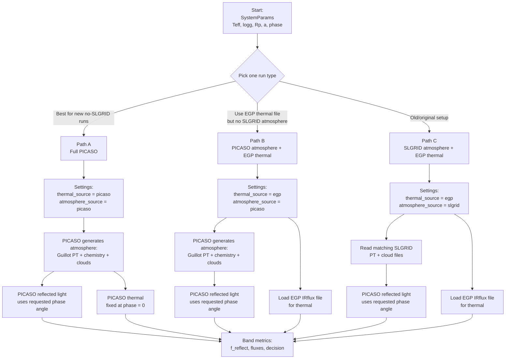
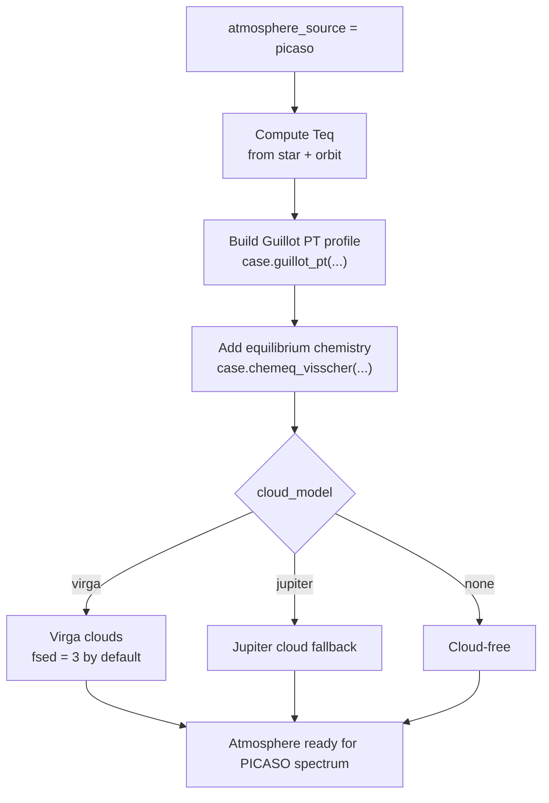

# RoadRunner Source Flowchart

This is the simplified version. Instead of showing every possible branch at once, choose one practical path first.



## Which Path Should I Use?

Use Path A if you want PICASO to handle everything and avoid SLGRID PT/cloud files:

```python
df = evaluate_hybrid_case(
    case,
    thermal_source="picaso",
    atmosphere_source="picaso",
    cloud_model="virga",
)
```

Use Path B if you trust/want the EGP thermal file, but still want no SLGRID atmosphere files:

```python
df = evaluate_hybrid_case(
    case,
    thermal_source="egp",
    atmosphere_source="picaso",
    cloud_model="virga",
)
```

Use Path C for the original comparison workflow:

```python
df = evaluate_hybrid_case(
    case,
    thermal_source="egp",
    atmosphere_source="slgrid",
)
```

## What Happens Inside PICASO Atmosphere?

This only happens when `atmosphere_source="picaso"`.



## Meaning Of The Switches

`thermal_source="egp"` uses the copied EGP `*_IRflux.txt` file for thermal emission.

`thermal_source="picaso"` uses PICASO for both reflected light and thermal emission.

`atmosphere_source="slgrid"` reads the precomputed SLGRID PT and cloud files.

`atmosphere_source="picaso"` builds the PT profile, chemistry, and clouds inside PICASO, so it does not use the SLGRID PT/cloud files.
