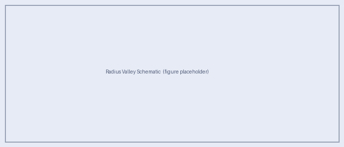

Science Motivation
==================

Can Sub-Neptunes Masquerade as Terrestrial Worlds in Reflected-Light Spectroscopy?
-----------------------------------------------------------------------------------

The Habitable Worlds Observatory (HWO) aims to directly image and spectrally
characterize Earth-sized planets.  A critical challenge for the mission is
**planet typing**: distinguishing truly terrestrial targets from larger,
volatile-rich planets that could appear "Earth-like" in low-resolution
reflected-light spectra.

The Radius Valley
-----------------

Transit surveys reveal a statistically significant deficit in planet occurrence
near 1.5–2.0 R\ :sub:`⊕` — the *radius valley* or *Fulton gap* — separating
smaller, predominantly rocky planets from larger sub-Neptunes whose radii are
inflated by gaseous envelopes (Fulton et al. 2017; Rogers 2015; Lopez &
Fortney 2014).

   *Schematic of the Fulton gap / radius valley.  Sub-Neptunes (> 1.6 R*\ :sub:`⊕`\
   *) harbour gaseous envelopes that inflate their radii.  In reflected-light
   direct imaging, planet radius is not directly measured, creating a pathway
   for "un-Earths" to occupy the same observable space as terrestrial planets.*

Mass–radius constraints further indicate that most planets larger than
~1.6 R\ :sub:`⊕` are not purely rocky (Rogers 2015), while thermal-evolution
models show that even percent-level H/He envelopes can substantially inflate
radii, yielding composition ambiguity near the valley (Lopez & Fortney 2014).

The Confusion Problem
---------------------

Future direct-imaging missions like HWO observe planets in **reflected light**
and measure planet–star flux ratios and spectra rather than transit radii.
With limited spectral coverage and finite SNR, several effects conspire to
make a sub-Neptune look terrestrial:

* **Cloud decks** mute absorption features and flatten spectral slopes.
* **High metallicity** increases mean molecular weight, reducing scale heights
  and suppressing the contrast of molecular bands.
* **Phase and separation degeneracies** alter the observed flux ratio in ways
  that are hard to decouple from atmospheric composition at low S/N.

This motivates a forward-model grid study that explicitly maps where in
parameter space sub-Neptunes become spectrally *confusable* with terrestrial
analogs — and identifies which wavelength coverage is most diagnostic.

Aurora's Scientific Objectives
-------------------------------

**Central objective:** Determine whether sub-Neptunes near the radius valley
can be reliably distinguished from terrestrial planets using reflected-light
spectroscopy under HWO-relevant conditions.

**Specific aims:**

1. Build a forward-model grid of sub-Neptune reflected-light spectra varying:

   * Host star type across the supported 3500, 4000, 5000, 6000, and 7000 K points
   * HZ-relevant separations / insolation regimes
   * Planet mass and radius, with surface gravity derived as :math:`g = GM/R^2`
   * Heavy-element enrichment (metallicity = 1, 10, and 100× solar)
   * Cloud coverage, sedimentation efficiency, and mixing strength

2. Assemble comparison spectra for:

   * Disk-integrated modern Earth benchmarks validated against EPOXI spacecraft
     observations (Robinson et al. 2011)
   * Abiotic terrestrial secondary-atmosphere analogs with self-consistent
     patchy clouds (Windsor et al. 2023)

3. Identify wavelength regions / feature combinations that best separate
   envelope-bearing planets from terrestrial analogs despite cloud and
   composition degeneracies.

4. Translate results into **wavelength-coverage guidance** for planet-typing in
   future direct-imaging surveys.

Confusion Diagnostics
---------------------

Aurora quantifies "confusion" using a combination of physically interpretable
diagnostics and statistical similarity under assumed measurement noise floors:

* **Band-depth contrasts** for major absorbers (H\ :sub:`2`\ O, CH\ :sub:`4`,
  CO\ :sub:`2`)
* **Spectral slopes** (Rayleigh regime vs. cloud-flattened continua)
* **Continuum shape / CIA signatures** consistent with H\ :sub:`2`-rich envelopes
* **Similarity metrics** that define observational degeneracy as spectra
  statistically indistinguishable at realistic uncertainties

The output will be a mapped *confusion region* in
(enrichment, cloud coverage, mass-radius, separation, host-star type) parameter space,
along with a set of recommended wavelength windows that best reduce ambiguity.

Interdisciplinary Relevance
---------------------------

* **Exoplanet demographics & evolution:** the radius valley identifies a
  population boundary shaped by formation and atmospheric loss.
* **Atmospheric physics & radiative transfer:** reflected-light spectra encode
  scattering, molecular absorption, and clouds; PICASO is designed for this
  regime (Batalha et al. 2019).
* **Astrobiology & life-detection strategy:** correct planet typing reduces
  habitability false positives and improves confidence in interpreting spectra
  as evidence for (or against) habitable conditions.

Expected Deliverables
---------------------

1. A documented library / grid of sub-Neptune reflected-light spectra across
   the supported host-star grid, HZ-relevant separations, mass-radius values,
   enrichment, and cloud parameters.
2. Quantitative identification of the most diagnostic spectral regions that
   discriminate sub-Neptunes from terrestrial/abiotic analogs.
3. Wavelength-coverage guidance for planet-typing in future direct-imaging
   surveys such as HWO.

References
----------

* Batalha, N.E. et al. 2019, *ApJ*, 878, 70.
  `doi:10.3847/1538-4357/ab1b51 <https://doi.org/10.3847/1538-4357/ab1b51>`_
* Fulton, B.J. et al. 2017, *AJ*, 154, 109.
  `doi:10.3847/1538-3881/aa80eb <https://doi.org/10.3847/1538-3881/aa80eb>`_
* Lopez, E.D. & Fortney, J.J. 2014, *ApJ*, 792, 1.
  `doi:10.1088/0004-637X/792/1/1 <https://doi.org/10.1088/0004-637X/792/1/1>`_
* Robinson, T.D. et al. 2011, *Astrobiology*, 11, 393.
  `doi:10.1089/ast.2011.0642 <https://doi.org/10.1089/ast.2011.0642>`_
* Rogers, L.A. 2015, *ApJ*, 801, 41.
  `doi:10.1088/0004-637X/801/1/41 <https://doi.org/10.1088/0004-637X/801/1/41>`_
* Windsor, J.D. et al. 2023, *PSJ*, 4, 94.
  `doi:10.3847/PSJ/acbf2d <https://doi.org/10.3847/PSJ/acbf2d>`_
