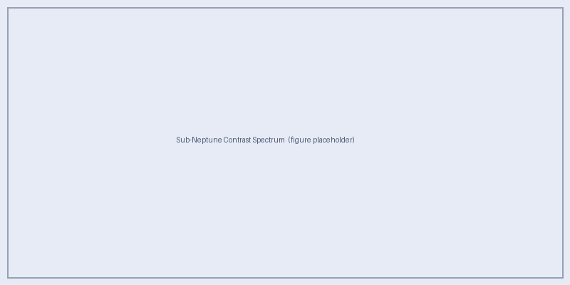

Modeling Sub-Neptunes Near the Radius Valley
=============================================

Can we distinguish sub-Neptune envelopes from terrestrial atmospheres with
HWO-relevant spectroscopy?

Sub-Neptunes near the radius valley (1.5–2.5 R\ :sub:`⊕`) are the primary
science targets of Aurora.  These planets straddle the transition between
rocky super-Earths and volatile-rich sub-Neptunes, and their reflected-light
spectra can closely mimic those of terrestrial planets when cloud decks mute
absorption features and high metallicity compresses scale heights.
The current production grid extends this radius-valley core to 3.0
R\ :sub:`⊕`, uses planet mass and radius as the primary planet axes, and derives
surface gravity per model row as :math:`g = GM/R^2`.

This page describes the Aurora sub-Neptune model framework and previews the
expected science output.

.. important::

   Full model results will be posted here once the ``aurora_subneptune_v1``
   production grid completes on HPC.  The descriptions below document the
   model setup and expected outputs.

Planet and Atmosphere Setup
----------------------------

Each Aurora sub-Neptune model has the following characteristics:

* **Bulk composition:** H\ :sub:`2`/He-dominated envelope, with metallicity
  parametrically varying the heavy-element enrichment of all condensable and
  absorbing species.
* **Self-consistent P–T profile:** PICASO's ``picaso_climate`` solves for the
  pressure–temperature structure given the stellar irradiation, planet gravity,
  and atmospheric composition.
* **Equilibrium chemistry:** Molecular mixing ratios are computed in chemical
  equilibrium at each pressure level, with the C/O ratio as a free parameter.
* **Clouds from Virga:** Virga computes the cloud microphysics (particle size
  distribution, column optical depth) given the P–T profile, gravity, and
  mixing strength K\ :sub:`zz`.

Current Production Parameter Space
~~~~~~~~~~~~~~~~~~~~~~~~~~~~~~~~~~

The supported ``aurora_subneptune_v1`` grid contains 960,000 spectra in
160,000 climate groups: five host-star points (3500/0.45, 4000/0.63,
5000/0.80, 6000/1.00, and 7000/1.70 in K/R\ :sub:`☉`), four radii (1.6, 2.0,
2.5, 3.0 R\ :sub:`⊕`), five masses (2.037, 4.073, 6.110, 10.183, 12.220
M\ :sub:`⊕`), three metallicities (1, 10, 100× solar), three C/O ratios (0.5,
1.0, 2.0× solar), two
K\ :sub:`zz` values (10\ :sup:`9`, 10\ :sup:`11` cm\ :sup:`2` s\ :sup:`−1`),
five cloud fractions (0, 0.5, 0.75, 0.9, 1), five f\ :sub:`sed` values
(0.3, 1, 3, 6, 8), four insolation values (0.35, 0.70, 1.00, 1.50
S\ :sub:`⊕`), and six phase angles (0, 30, 60, 90, 120, 150°).

The axes nominally define 1,080,000 spectra in 180,000 climate groups.  The
100× solar metallicity, 2× solar C/O pair is not runnable because PICASO 4 does
not provide the required ``sonora_2121grid_feh2.0_co1.10.hdf5`` correlated-k
table.  Removing that pair subtracts 20,000 climate groups and 120,000 spectra.

Expected Cloud Species
~~~~~~~~~~~~~~~~~~~~~~

For the P–T profiles expected in the sub-Neptune insolation range
(0.35–1.5 S\ :sub:`⊕`), the following condensate species are anticipated:

* **Water ice / liquid water** — dominant in the outer HZ models
  (0.35–0.7 S\ :sub:`⊕`)
* **Sulphur haze (S**\ :sub:`8`\ **clouds)** — relevant for warmer models
  (1.0–1.5 S\ :sub:`⊕`)
* **Ammonium hydrosulfide (NH**\ :sub:`4`\ **SH)** — for cooler, high-metallicity
  models

As in Cahoy et al. (2010), whether a condensate species forms clouds depends
on whether its condensation curve crosses below the model P–T profile in the
observable atmosphere.

Effect of C/O Ratio
~~~~~~~~~~~~~~~~~~~

The C/O ratio controls the relative mixing ratios of water, methane, and
carbon monoxide.  At C/O < 1 (oxygen-rich), water is the dominant absorber;
at C/O > 1 (carbon-rich), methane and CO dominate.  For sub-Neptunes near the
radius valley:

* The P–T profile is relatively insensitive to C/O ratio because irradiation
  (not internal heat) drives the upper-atmosphere thermal structure.
* Molecular absorption band depths and the NIR spectral shape are strongly
  affected.
* C/O = 0.5, 1.0, 2.0 (× solar) span the range from oxygen-rich to
  carbon-rich envelopes.

Phase Sampling
--------------

Aurora samples six viewing phases for each sub-Neptune orbit:

.. list-table::
   :header-rows: 1
   :widths: 20 80

   * - Phase (deg)
     - Description
   * - 0
     - Superior conjunction — fully illuminated hemisphere, minimum angular separation
   * - 30
     - Nearly full phase, moderate separation
   * - 60
     - Gibbous — typical observability window for inner HZ
   * - 90
     - Quadrature — maximum angular separation for circular orbits
   * - 120
     - Half-illuminated crescent
   * - 150
     - Deep crescent — high phase, small illuminated fraction

.. note::

   Phase does not affect the P–T profile or cloud structure.  All six phases
   share a single cached climate solution per (planet, star, cloud, chemistry)
   combination — this is the key efficiency gain of the two-stage workflow.

Insolation Grid
~~~~~~~~~~~~~~~

Four insolation values bracket the range from the outer edge of the habitable
zone to slightly super-Earth-equivalent:

.. list-table::
   :header-rows: 1
   :widths: 20 80

   * - S (S\ :sub:`⊕`)
     - Context
   * - 0.35
     - Outer HZ — analogue of Mars-orbit irradiation around a solar-type host
   * - 0.70
     - Outer-mid HZ — analogue of Venus inside the outer HZ boundary
   * - 1.00
     - Earth-equivalent insolation (1 AU, solar-type host)
   * - 1.50
     - Inner HZ — warm, near the inner edge of the conservative HZ

Expected Spectral Features
---------------------------

The planet–star contrast spectrum encodes:

**Rayleigh scattering slope (< 0.5 μm)**
   All models show a steep rise to the blue from H\ :sub:`2`/He Rayleigh
   scattering.  Cloud decks above the scattering level suppress this feature.

**Water vapour bands**
   Strong absorption at 0.72, 0.82, 0.94, 1.14, 1.38, and 1.87 μm.  Depth
   decreases with increasing metallicity (shorter scale height) and with
   overlying cloud opacity.

**Methane bands (for C/O ≥ 1)**
   Features at 0.89, 1.0, 1.38, 1.67, and 2.30 μm become prominent in
   carbon-rich or cold models where CH\ :sub:`4` dominates over CO.

**Continuum slope**
   A red-sloped continuum from the H\ :sub:`2`/He CIA opacity at NIR
   wavelengths is a signature of a hydrogen-dominated atmosphere absent in
   rocky-planet models.

   *Expected output: Planet–star contrast spectrum for an Aurora sub-Neptune
   model at quadrature (phase = 90°) around a solar-type host (T*\ :sub:`eff`
   *= 5000 K) at 1.0 S*\ :sub:`⊕`\ *, showing the effect of cloud opacity
   (f*\ :sub:`sed`\ * = 0.3, 1, 6, and cloud-free) for a 2.0 R*\ :sub:`⊕`
   *planet with 10× solar metallicity.  Molecular absorption bands are labelled
   for the cloud-free case.  Filter curves for HWO-like optical/NIR channels
   are shown in grey.*

Planet-Typing Diagnostics
--------------------------

Aurora's primary science output is a *confusion map* in parameter space
identifying where sub-Neptunes are spectrally indistinguishable from
terrestrial planets at HWO-like S/N.

The following broadband diagnostics are computed for each spectrum:

* **Spectral slope** between optical (0.4–0.5 μm) and NIR (1.0–1.3 μm)
* **H**\ :sub:`2`\ **O 0.94 μm band depth**
* **H**\ :sub:`2`\ **O 1.14 μm band depth**
* **CH**\ :sub:`4` **1.0 μm band depth**
* **CH**\ :sub:`4` **1.67 μm band depth**
* **CIA continuum slope** (1.3–1.7 μm vs. 0.7–0.9 μm)

Color–Magnitude Comparisons
~~~~~~~~~~~~~~~~~~~~~~~~~~~

Photometric color–magnitude diagrams analogous to those in Logan Pearce's
`ReflectX GJ 876 analysis <https://reflectx.readthedocs.io/en/latest/GJ876bc-models.html>`_
will be produced for the HWO-like filter set once the full grid is available.
The expected filter passbands mirror the Roman CGI / HWO coronagraph channels:

* Blue optical (0.45–0.55 μm)
* Red optical (0.60–0.70 μm)
* NIR-J (1.12–1.35 μm)
* NIR-H (1.50–1.80 μm)

Phase Curve Behaviour
~~~~~~~~~~~~~~~~~~~~~

Phase curves for sub-Neptunes near the radius valley are expected to differ
qualitatively from gas-giant phase curves studied in the Cahoy grid:

* **Thick clouds** (small f\ :sub:`sed`) produce relatively flat phase curves
  because isotropic scattering distributes reflected light broadly.
* **Thin or patchy clouds** (large f\ :sub:`sed` or cloud fraction = 0) show
  steeper phase curves with stronger forward-scattering enhancement.
* **High metallicity** compresses the scale height, reducing the effective
  scattering depth and flattening the phase curve.

These signatures — or their absence — are key discriminants between genuinely
terrestrial planets and gas-rich sub-Neptunes when observed at a small number
of orbital phases with HWO.

References
----------

* Batalha, N.E. et al. 2019, *ApJ*, 878, 70.
  `doi:10.3847/1538-4357/ab1b51 <https://doi.org/10.3847/1538-4357/ab1b51>`_
* Cahoy, K.L., Marley, M.S. & Fortney, J.J. 2010, *ApJ*, 724, 189.
  `doi:10.1088/0004-637X/724/1/189 <https://doi.org/10.1088/0004-637X/724/1/189>`_
* Fulton, B.J. et al. 2017, *AJ*, 154, 109.
  `doi:10.3847/1538-3881/aa80eb <https://doi.org/10.3847/1538-3881/aa80eb>`_
* Gao, P. et al. 2018, *ApJ*, 867, 1.
  `doi:10.3847/1538-4357/aad1f9 <https://doi.org/10.3847/1538-4357/aad1f9>`_
* Lopez, E.D. & Fortney, J.J. 2014, *ApJ*, 792, 1.
  `doi:10.1088/0004-637X/792/1/1 <https://doi.org/10.1088/0004-637X/792/1/1>`_
* Mukherjee, S. et al. 2022, *ApJ*, 938, 107.
  `doi:10.3847/1538-4357/ac8f41 <https://doi.org/10.3847/1538-4357/ac8f41>`_
* Robinson, T.D. et al. 2011, *Astrobiology*, 11, 393.
  `doi:10.1089/ast.2011.0642 <https://doi.org/10.1089/ast.2011.0642>`_
* Rogers, L.A. 2015, *ApJ*, 801, 41.
  `doi:10.1088/0004-637X/801/1/41 <https://doi.org/10.1088/0004-637X/801/1/41>`_
* Windsor, J.D. et al. 2023, *PSJ*, 4, 94.
  `doi:10.3847/PSJ/acbf2d <https://doi.org/10.3847/PSJ/acbf2d>`_
